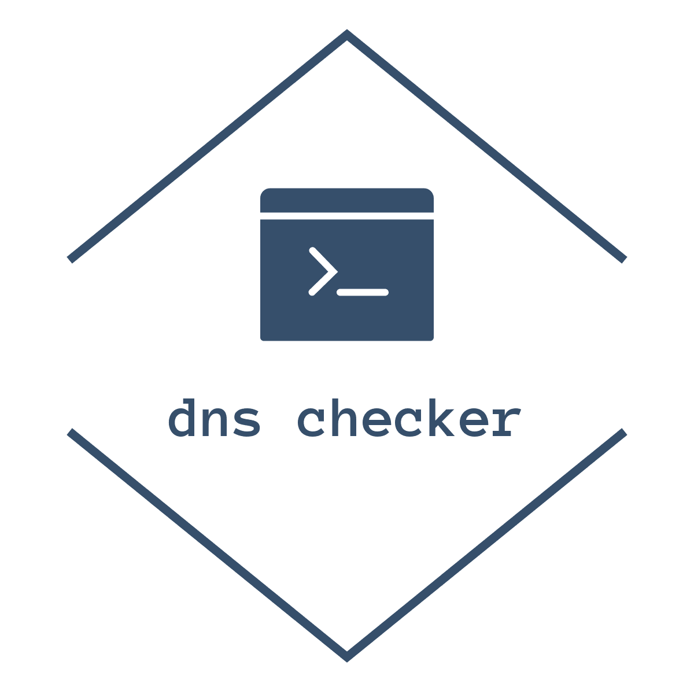

<!--
*** Thanks for checking out this README Template. If you have a suggestion that would
*** make this better, please fork the repo and create a pull request or simply open
*** an issue with the tag "enhancement".
*** Thanks again! Now go create something AMAZING! :D
-->


<!-- PROJECT SHIELDS -->
<!--
*** I'm using markdown "reference style" links for readability.
*** Reference links are enclosed in brackets [ ] instead of parentheses ( ).
*** See the bottom of this document for the declaration of the reference variables
*** for contributors-url, forks-url, etc. This is an optional, concise syntax you may use.
*** https://www.markdownguide.org/basic-syntax/#reference-style-links
-->
[![Contributors][contributors-shield]][contributors-url]
[![Forks][forks-shield]][forks-url]
[![Stargazers][stars-shield]][stars-url]
[![Issues][issues-shield]][issues-url]
[![MIT License][license-shield]][license-url]
[![LinkedIn][linkedin-shield]][linkedin-url]


<!-- PROJECT LOGO -->
<br />
<p align="center">
  <a href="https://github.com/antoniodvr/dns-checker">
    
  </a>

  <h3 align="center">DNS Checker</h3>

  <p align="center">
    A simple domain namespace expiration checker.
    <a href="https://github.com/antoniodvr/dns-checker">
    <br />
    <strong>Explore the docs »</strong></a>
    <br />
    <br />
    <a href="#usage">View Usage</a>
    ·
    <a href="https://github.com/antoniodvr/dns-checker/issues">Report Bug</a>
    ·
    <a href="https://github.com/antoniodvr/dns-checker/issues">Request Feature</a>
  </p>
</p>


<!-- TABLE OF CONTENTS -->
## Table of Contents

* [About the Project](#about-the-project)
  * [Built With](#built-with)
* [Getting Started](#getting-started)
  * [Prerequisites](#prerequisites)
  * [Installation](#installation)
* [Usage](#usage)
* [Roadmap](#roadmap)
* [Contributing](#contributing)
* [License](#license)
* [Contact](#contact)
* [Acknowledgements](#acknowledgements)


<!-- ABOUT THE PROJECT -->
## About The Project

<!-- [![Product Name Screen Shot][product-screenshot]](https://example.com) -->

DNS Expiration Checker is a simple tool to check the expiration for most of the popular top-level domain (TLD).

### Built With

* [Python](https://www.python.org/) 
* [pip](https://pip.pypa.io/en/stable/)


<!-- GETTING STARTED -->
## Getting Started

This is an example of how you may give instructions on setting up your project locally.
To get a local copy up and running follow these simple example steps.

### Prerequisites

This is an example of how to list things you need to use the software and how to install them.

It works with Python 3.x.

```sh
$ sudo apt-get update
$ sudo apt-get install whois
$ sudo apt-get install python3.x
```

### Installation

1. Clone the repo
```sh
$ git clone https://github.com/antoniodvr/dns-checker.git
$ cd dns-checker
```
2. Install packages
```sh
$ pip install -r requirements.txt
```


<!-- USAGE EXAMPLES -->
## Usage

```sh
$ python dns-checker.py --help
usage: dns-checker.py [-h] (-f FILE | -d DOMAIN)

DNS Checker

optional arguments:
  -h, --help                  show this help message and exit
  -f FILE, --file FILE        File path containing the domains list
  -d DOMAIN, --domain DOMAIN  Domain name
```

### Check a domain name

```sh
$ python dns-checker.py --domain google.com

DOMAIN NAME                REGISTRAR                            EXPIRATION DATE                 DAYS LEFT
google.com                 MarkMonitor Inc.                     2028-09-14 04:00:00             3161
```


### Check a domain name list

```sh
$ cat - > domains
google.com
yahoo.com
microsoft.com
apple.com
```

```sh
$ python dns-checker.py --file domains

DOMAIN NAME                REGISTRAR                            EXPIRATION DATE                 DAYS LEFT
google.com                 MarkMonitor Inc.                     2028-09-14 04:00:00             3161
yahoo.com                  MarkMonitor Inc.                     2023-01-19 05:00:00             1096
microsoft.com              MarkMonitor Inc.                     2021-05-03 04:00:00             470
apple.com                  CSC Corporate Domains, Inc.          2021-02-20 05:00:00             398
```

_For more examples, please refer to the [Documentation](https://github.com/antoniodvr/dns-checker)_


<!-- ROADMAP -->
## Roadmap

See the [open issues](https://github.com/antoniodvr/dns-checker/issues) for a list of proposed features (and known issues).


<!-- CONTRIBUTING -->
## Contributing

Contributions are what make the open source community such an amazing place to be learn, inspire, and create. Any contributions you make are **greatly appreciated**.

1. Fork the Project
2. Create your Feature Branch (`git checkout -b feature/AmazingFeature`)
3. Commit your Changes (`git commit -m 'Add some AmazingFeature'`)
4. Push to the Branch (`git push origin feature/AmazingFeature`)
5. Open a Pull Request


<!-- LICENSE -->
## License

Distributed under the MIT License. See `LICENSE` for more information.


<!-- CONTACT -->
## Contact

Antonio Di Virgilio - [@antoniodvr](https://linkedin.com/in/antoniodvr)


<!-- MARKDOWN LINKS & IMAGES -->
<!-- https://www.markdownguide.org/basic-syntax/#reference-style-links -->
[contributors-shield]: https://img.shields.io/github/contributors/antoniodvr/dns-checker.svg?style=flat-square
[contributors-url]: https://github.com/antoniodvr/dns-checker/graphs/contributors
[forks-shield]: https://img.shields.io/github/forks/antoniodvr/dns-checker.svg?style=flat-square
[forks-url]: https://github.com/antoniodvr/dns-checker/network/members
[stars-shield]: https://img.shields.io/github/stars/antoniodvr/dns-checker.svg?style=flat-square
[stars-url]: https://github.com/antoniodvr/dns-checker/stargazers
[issues-shield]: https://img.shields.io/github/issues/antoniodvr/dns-checker.svg?style=flat-square
[issues-url]: https://github.com/antoniodvr/dns-checker/issues
[license-shield]: https://img.shields.io/github/license/antoniodvr/dns-checker.svg?style=flat-square
[license-url]: https://github.com/antoniodvr/dns-checker/blob/master/LICENSE.md
[linkedin-shield]: https://img.shields.io/badge/-LinkedIn-black.svg?style=flat-square&logo=linkedin&colorB=555
[linkedin-url]: https://linkedin.com/in/antoniodvr
